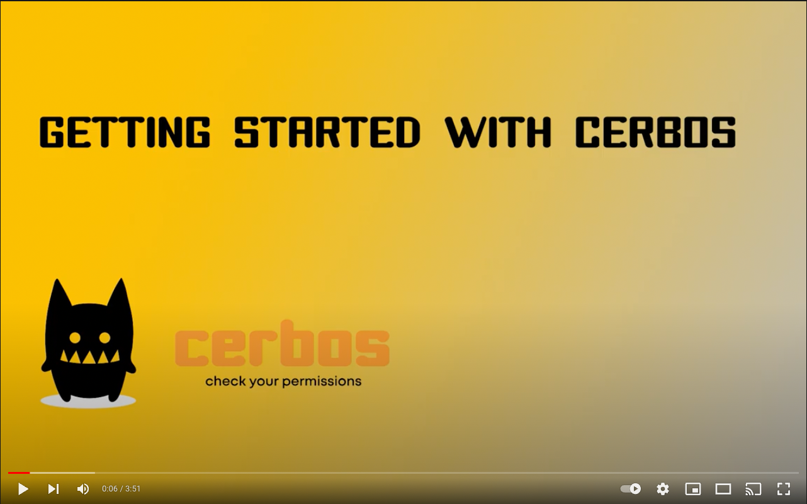

# Getting Started - Node.js

An example application of integrating [Cerbos](https://cerbos.dev) with an [Express](https://expressjs.com/) server.

<a href="https://www.youtube.com/watch?v=caqUh6i3vVQ" target="_blank"></a>

## Dependencies

- Node.js
- Docker for running the [Cerbos Policy Decision Point (PDP)](https://docs.cerbos.dev/cerbos/latest/installation/container.html)

## Getting Started

1. Start up the Cerbos PDP instance docker container. This will be called by the express app to check authorization.

```bash
cd cerbos
./start.sh
```

2. Install node dependencies

```bash
npm install
```

3. Start the express server

```bash
npm run start
```
